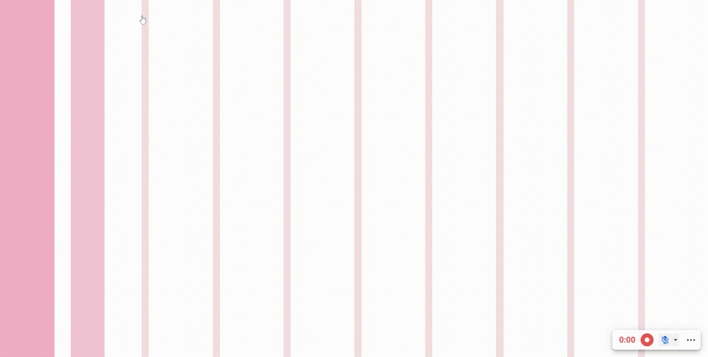
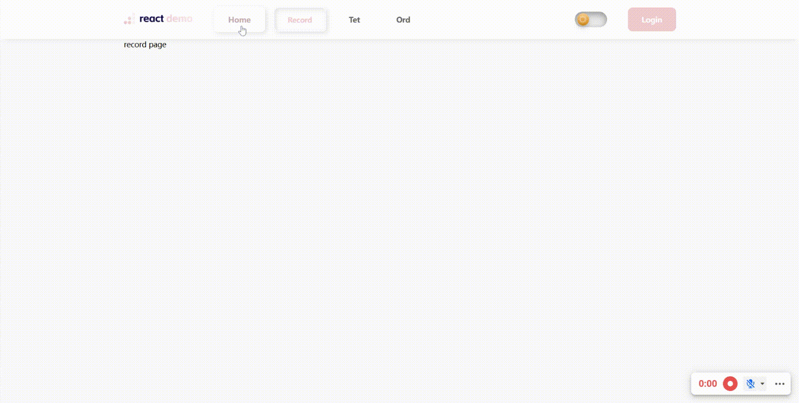
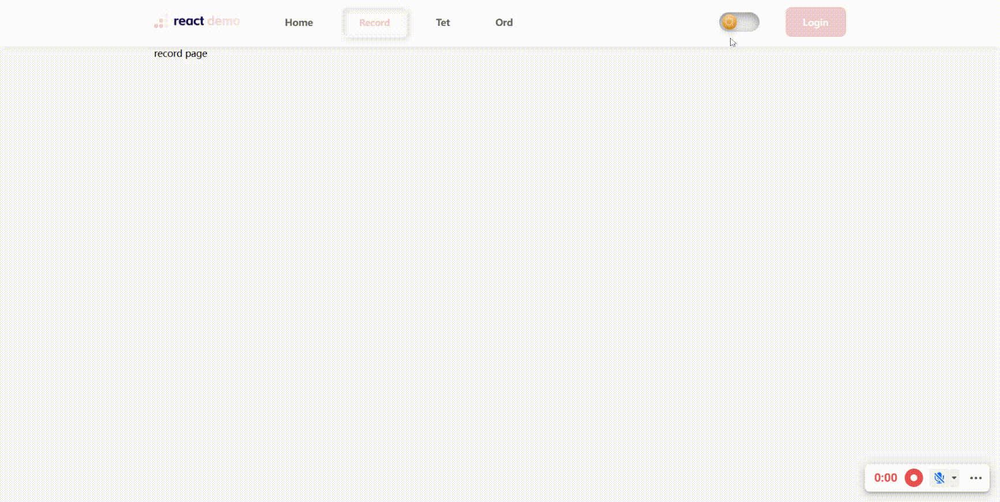
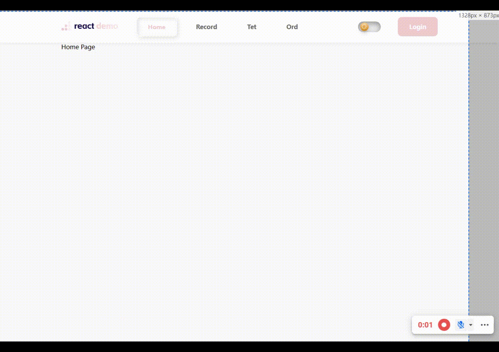

# React + Vite 项目

## 介绍

这是一个 `React + Vite` 搭建的项目，是我自己学习 **React** 所搭建的一个简单的网站。但也不能说是网站，因为这个项目目前只有一些网站的雏形，主要是想通过自己搭建项目，去深入学习 **React** ，根据自己想开发的内容中，去完善页面内容，在过程中学习和应用 **React** 的相关基础知识。后续应该会继续完善，目前暂时没有什么具体规划。

项目界面，主打一个~~随性~~**拟物风格（Neumorphism）**，一直挺想做一个这样风格的网站或者APP

你可以把它当作一个简单的网站模板，毕竟基础功能差不多都有了，就差往里面填充内容了

感兴趣的小伙伴，欢迎 **Star** 和 **Fork** ~

本项目具体包含以下内容：

### 页面元素（功能）

- 首页
    - 顶部导航栏
    - 局部动态路由跳转部分
- 开屏动画
- 页面跳转动画
- 暗黑主题切换
- 移动端适配

### React - 相关知识点

- 路由跳转
- 路由封装
- 类组件
- 函数组件
- 组件通信
- Redux
- Reducer

**Redux** 与 **Reducer**，在这个项目中原来有用到，但是后面被我去除了。但是我还保留着，具体使用部分可以在我的归档文博里进行查看：[请点击此处跳转]('https://jacindatang.vercel.app/note/react/redux.html')

## Start

```bash
npm install
```

```bash
npm run dev
```

:::tip
如果安装或者运行失败， 需要把 `node` 版本提高到 `16+`. 我自己用的版本是 16.14.1
:::

## Screenshot

大致效果截图，页面内容比较少。

动画效果，实现起来感觉还是比较复杂，索性就直接从 **CodePen** 上找找比较喜欢的，拿来用上啦！

### 开屏动画

这个动画效果，是从 **CodePen** 上拿过来的，源链接：[点击此处]('https://codepen.io/juliepark/pen/pXoEqy')

 

### 页面跳转过渡动画

源链接：[点击此处]('https://codepen.io/mitori/details/zLKZVZ')

这块，不知道是我路由没有写好，还是我过渡动画组件封装的问题，会有点小**bug**： 第一次点击页面跳转时，会先是整个页面纯色背景，过一会才会向下图这样过渡流畅。如果有小伙伴能解决，欢迎在 **issue** 中讨论一下，非常感谢！

 

### 暗黑主题切换

 

### 移动端适配

 